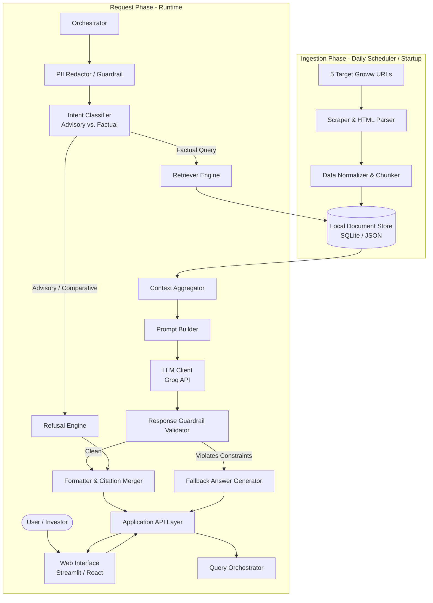
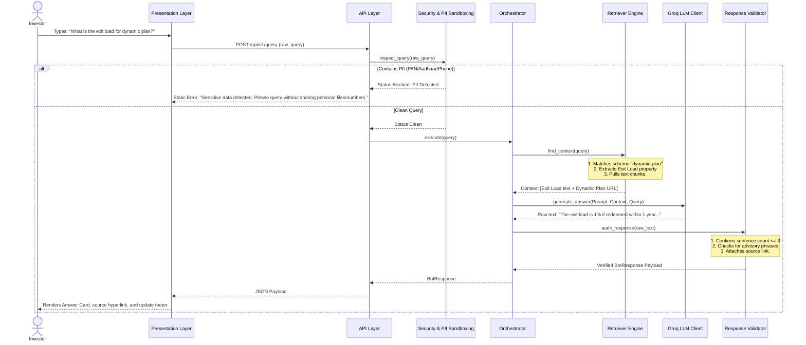

# Architecture: Mutual Fund FAQ Assistant (Facts-Only Q&A)

This document describes the technical architecture for the Mutual Fund FAQ Assistant. It defines the components, data models, logical layers, request lifecycles, prompt construction principles, security sandboxes, and testing strategy for a greenfield build.

---

## Table of Contents
1. [Goals and Constraints](#goals-and-constraints)
2. [High-Level Architecture](#high-level-architecture)
3. [Logical Layers](#logical-layers)
4. [Component Design](#component-design)
5. [Data Architecture](#data-architecture)
6. [Request Lifecycle](#request-lifecycle)
7. [LLM Integration Architecture](#llm-integration-architecture)
8. [API Design](#api-design)
9. [Presentation Layer](#presentation-layer)
10. [Cross-Cutting Concerns & Security](#cross-cutting-concerns--security)
11. [Proposed Repository Structure](#proposed-repository-structure)
12. [Technology Options](#technology-options)
13. [Testing Strategy](#testing-strategy)

---

## Goals and Constraints

### Primary Goals

| Goal | Description |
| :--- | :--- |
| **Facts-Only Grounding** | Retrieve and answer mutual fund scheme FAQ queries exclusively based on the 5 target ICICI Prudential mutual fund URLs. |
| **Strict Compliance** | Zero tolerance for financial/investment advice, returns forecasting, or comparative recommendation queries. |
| **Source Citations** | Every valid answer must include exactly one clear citation link corresponding to the source page. |
| **Conciseness** | Responses must be compact and limited to a maximum of 3 sentences. |
| **System Transparency** | Every response must display a footer indicating the last source update date: `“Last updated from sources: <date>”`. |

### Architectural Constraints
- **Deterministic Filtering & Extraction:** Pre-extract structured data (such as expense ratios, entry/exit loads, and fund managers) to ensure high-fidelity lookups and prevent LLM hallucinations.
- **Strict Sandbox / Privacy Limits:** Do not capture, process, store, or forward any personally identifiable information (PII) including PAN numbers, Aadhaar card numbers, bank accounts, OTPs, emails, or phone numbers.
- **Out of Scope (Initial MVP):** 
  - User accounts, authentication, or saved query histories.
  - Performance comparisons or return calculations.
  - Interactive purchase workflows or Groww transaction links.

---

## High-Level Architecture

The system follows a Retrieval-Augmented Generation (RAG) architecture tailored for high compliance. Because the target corpus is limited to 5 specific URLs, the design prioritizes precision over massive scale.



---

## Logical Layers

```
┌────────────────────────────────────────────────────────────────────────────┐
│                        PRESENTATION LAYER                                  │
│  Chat Input Panel · Example Questions Widgets · Compliance Disclaimer      │
└────────────────────────────────────────────────────────────────────────────┘
                                      │
                                      ▼
┌────────────────────────────────────────────────────────────────────────────┐
│                        APPLICATION / API LAYER                             │
│  Validate Payload · Endpoint Router · Request Logs · Error Catching        │
└────────────────────────────────────────────────────────────────────────────┘
                                      │
                                      ▼
┌────────────────────────────────────────────────────────────────────────────┐
│                        SECURITY & COMPLIANCE LAYER                         │
│  PII Sandbox Regex · Intent Classifier (Factual vs. Financial Advice)       │
└────────────────────────────────────────────────────────────────────────────┘
                                      │
                                      ▼
┌────────────────────────────────────────────────────────────────────────────┐
│                        DOMAIN / ORCHESTRATION LAYER                        │
│  QueryOrchestrator: Retrieval → Prompt Compiler → LLM → Response Auditor   │
└────────────────────────────────────────────────────────────────────────────┘
                                      │
                     ┌─────────────────┼─────────────────┐
                     ▼                 ▼                 ▼
┌──────────────────────┐ ┌──────────────────┐ ┌────────────────────────────┐
│   RETRIEVAL LAYER    │ │ INTEGRATION LAYER│ │   GENERATION ENGINE        │
│   SQLite / JSON Repo │ │ Prompt Builder   │ │ LLM Client (Groq)          │
│   BM25 / Keyword     │ │ Template Manager │ │ Response Parser            │
└──────────────────────┘ └──────────────────┘ └────────────────────────────┘
                     │
                     ▼
┌────────────────────────────────────────────────────────────────────────────┐
│                   DATA INGESTION LAYER (Daily Scheduler)                    │
│  BeautifulSoup Web Scraper · Attribute Extractor · Local Storage Writer    │
└────────────────────────────────────────────────────────────────────────────┘
```

---

## Component Design

### 1. Ingestion Pipeline
- **Daily Ingestion Scheduler:** A cron job or background execution scheduler triggers the ingestion pipeline daily to ensure mutual fund facts (NAV, expense ratios, asset holdings, etc.) remain current.
- **WebScraper:** Initiated by the daily trigger, it downloads raw HTML contents from the 5 specified Groww URLs.
- **Normalizer/Chunker:**
  - Standardizes raw string data into a structured schema (e.g. converting `0.75%` to a standardized string format for the expense ratio).
  - Segregates unstructured data (such as manager biography details or fund descriptions) into semantic chunks of roughly 250 words.
  - Attaches parent URL metadata to every chunk.

### 2. Local Document Store
- An offline database (using SQLite or JSON files) containing two datasets:
  - **Structured Scheme Properties:** Pre-extracted metrics (expense ratio, exit load, minimum SIP, ELSS category, riskometer, benchmark, fund manager list).
  - **Unstructured Chunks:** Plain-text fragments of scheme pages for semantic retrieval.

### 3. PII Sandbox Guardrail
- Scans input queries using high-performance regex strings to look for:
  - **PAN Card Numbers:** `[A-Z]{5}[0-9]{4}[A-Z]{1}`
  - **Aadhaar Numbers:** `^[2-9]{1}[0-9]{3}[\\s-]?[0-9]{4}[\\s-]?[0-9]{4}$`
  - **Email Addresses:** Standard RFC 5322 regex.
  - **Phone Numbers:** `^(\+91[\-\s]?)?[0-9]{10}$`
  - **Bank Account / OTP structures.**
- If PII is found, the query is immediately blocked and a static refusal message is returned.

### 4. Intent Classifier
- Classifies incoming queries into:
  - `FACTUAL`: Requests specific parameters, manager background, or download instructions (routed to Retriever).
  - `ADVISORY`: Queries like "Should I invest?", "Is this fund good?", "Which is better?" (routed to Refusal Engine).

### 5. Retriever Engine
- Performs search across Scheme and Chunk tables.
- **Structured Matching:** Direct lookup of pre-mapped keys (e.g. query contains "exit load" → retrieves exit load string directly from the Scheme database).
- **Unstructured Matching:** Utilizes keyword similarity (TF-IDF/BM25) or embedding similarity to pull matching manager tenure or scheme philosophy passages.

### 6. Prompt Builder & LLM Client
- Builds the prompt context with hard constraints.
- **LLM Client Wrapper:** Interfaces with the Groq API (using the fast `llama-3.3-70b-versatile` model). Keeps temperature low (`0.2`) to maintain high determinism.

### 7. Response Guardrail Validator
- Performs post-processing checks on LLM generated answers:
  - **Sentence Count Enforcer:** Splits response by standard punctuation (`.`, `?`, `!`) and truncates anything past 3 sentences.
  - **Compliance Check:** Scans the text for speculative triggers ("buy", "recommend", "advice", "outperform", "suggest").
  - **Citation Attachment:** Automatically appends the exact source URL and the update date.

---

## Data Architecture

### Canonical Domain Model

#### Scheme Schema
```python
class Scheme:
    id: str                         # E.g., "icici-large-cap"
    name: str                       # E.g., "ICICI Prudential Large Cap Fund Direct Growth"
    source_url: str                 # Exact Groww page URL
    expense_ratio: str
    exit_load: str
    min_sip: float
    is_elss: bool
    riskometer_class: str           # E.g., "Very High"
    benchmark_index: str            # E.g., "NIFTY 100 TRI"
    fund_managers: list[dict]       # List of {"name": str, "tenure": str, "background": str}
    last_updated: str               # ISO date of source capture
```

#### DocumentChunk Schema
```python
class DocumentChunk:
    id: str
    scheme_id: str
    text_content: str
    source_url: str
```

#### BotResponse Schema
```python
class BotResponse:
    answer: str
    citation_url: str
    last_updated_date: str
    is_refusal: bool
```

---

## Request Lifecycle

Below is the request-response lifecycle for a factual mutual fund query:



---

## LLM Integration Architecture

### Provider Configuration
The system leverages the **Groq API** as the primary LLM platform to ensure low latency and high accuracy using `llama-3.3-70b-versatile`. 

#### Recommended Environment Settings (`.env`):
```ini
LLM_PROVIDER=groq
LLM_API_KEY=gsk_your_groq_api_key_goes_here
LLM_MODEL=llama-3.3-70b-versatile
LLM_TEMPERATURE=0.2
LLM_MAX_TOKENS=150
DATA_STORE_PATH=data/processed/schemes.json
```

### Prompting Principles
1. **Context-Locked Execution:** Explicitly instruct the model to fail-safe and say "Information not found in official source files" if the response cannot be completely constructed using the provided facts.
2. **Explicit Formats:** Mandate strict output patterns (e.g. JSON-mode completions) to ensure reliable parsing of answers.
3. **Refusal Reinforcement:** Feed example refusal formats directly into the system template instructions.

---

## API Design

The API exposes a minimal set of REST endpoints for query orchestration and UI metadata fetching.

### 1. Execute Query
- **Method:** `POST`
- **Path:** `/api/v1/query`
- **Request Body:**
  ```json
  {
    "query": "Who manages the infrastructure fund and what is their background?"
  }
  ```
- **Response Body (200 OK):**
  ```json
  {
    "answer": "The ICICI Prudential Infrastructure Fund is managed by Mr. Sankaran Naren. He has over 30 years of experience in the financial services sector and holds a PGDM from IIM Calcutta.",
    "citation_url": "https://groww.in/mutual-funds/icici-prudential-infrastructure-fund-direct-growth",
    "last_updated_date": "2026-06-07",
    "is_refusal": false
  }
  ```

### 2. Liveness Check
- **Method:** `GET`
- **Path:** `/api/v1/health`
- **Response:** `{"status": "healthy", "database_loaded": true}`

---

## Presentation Layer

A minimal, high-aesthetic layout built in **Streamlit** (or React):

1. **Header Section:** Welcome banner introducing the FAQ Assistant.
2. **Disclaimer Callout:** 
   > [!IMPORTANT]
   > **Disclaimer:** Facts-only FAQ assistant. This chatbot is strictly educational and does not provide investment advice, financial advice, performance comparisons, or buy/sell recommendations.
3. **Example Triggers:** Three quick-click buttons to seed example queries:
   - *"What is the exit load and minimum SIP for the Large Cap fund?"*
   - *"Tell me about the fund manager of the ICICI Infrastructure Fund."*
   - *"Should I invest in the Silver ETF fund?"*
4. **Chat History Box:** Displays conversation log using card-style message elements. Factual answers show a **"View Source Link"** button pointing directly to the verified Groww URL.

---

## Cross-Cutting Concerns & Security

### PII Sanitization Logic
- Any incoming input must pass through the `pii_redactor.py` service.
- If a signature match is triggered, the system logs a compliance alert (redacting the sensitive tokens) and immediately halts the orchestrator flow.

### Failures and Mitigations

| Failure Mode | Detection Indicator | Mitigation Strategy |
| :--- | :--- | :--- |
| **LLM Upstream Timeout** | HTTP client timeout | Fallback to direct structured SQL database query extraction and output a pre-formatted template. |
| **Advisory False Negative** | Validator detects words: "recommend", "better option" | Intercept in Response Validator and overwrite with polite refusal pointing to AMFI. |
| **Data Scraping Outage** | HTML payload size is too small or parsing error | Ingestion fails gracefully; local database continues serving historical backup data. |

---

## Proposed Repository Structure

```
mutual-fund-faq-assistant/
├── docs/
│   ├── problemStatement.md
│   └── architecture.md               # This file
├── data/
│   ├── raw/                          # Scraped raw HTML caching
│   └── processed/                    # Normalised JSON/SQLite databases
├── src/
│   └── app/
│       ├── __init__.py
│       ├── main.py                   # Streamlit UI / FastAPI Entry point
│       ├── config.py                 # Configuration parameters loader
│       ├── models/
│       │   └── domain.py             # Scheme, Chunk, and Response schemas
│       ├── Ingestion/
│       │   ├── scraper.py            # BeautifulSoup groww scraper
│       │   └── normalizer.py         # Content chunker & parser
│       ├── security/
│       │   ├── pii_redactor.py       # PII regex scanner
│       │   └── intent_classifier.py  # Checks advisory vs factual
│       ├── services/
│       │   ├── retriever.py          # Performs SQLite/BM25 context queries
│       │   ├── prompt_builder.py     # System instructions template engine
│       │   ├── llm_client.py         # Groq SDK abstraction
│       │   └── orchestrator.py       # Main control loop
│       └── ui/
│           └── components.py         # UI view cards & disclaimers
├── tests/
│   ├── test_pii_redactor.py          # Verifies PII redaction rules
│   ├── test_intent_classifier.py     # Verifies refusal routing
│   └── test_retriever.py             # Validates context selection
├── .env.example
├── requirements.txt
└── README.md
```

---

## Technology Options

| Stack Layer | Option A (Recommended Rapid Stack) | Option B (Enterprise Shape) |
| :--- | :--- | :--- |
| **Runtime Engine** | Python 3.11+ | Python 3.11+ |
| **UI Interface** | **Streamlit** (Fast layout, inline chat components) | React.js + Tailwind CSS |
| **API Framework** | In-process execution (Streamlit backend) | FastAPI (REST Router) |
| **Corpus Scraper** | BeautifulSoup4 + Requests | Playwright (Headless crawler) |
| **Local Search** | In-memory search / SQLite FTS5 | ChromaDB / Qdrant Vector DB |
| **LLM Inference** | **Groq SDK** (Llama-3.3-70b) | OpenAI API (GPT-4o-mini) |

---

## Testing Strategy

- **PII Redaction Unit Tests:** Run test strings containing mock Aadhaar, PAN, and phone numbers through the redactor and assert that they are cleanly identified and blocked.
- **Intent Classification Tests:** Run a suite of 20 test queries (10 factual, 10 advisory) and assert 100% correct classification routing.
- **Retriever Ground Truth Tests:** Assert that querying for "Large cap exit load" retrieves the chunk belonging to the Large Cap scheme URL.
- **Length Constraint Assertions:** Assert that the final response output contains `≤ 3` sentences.
